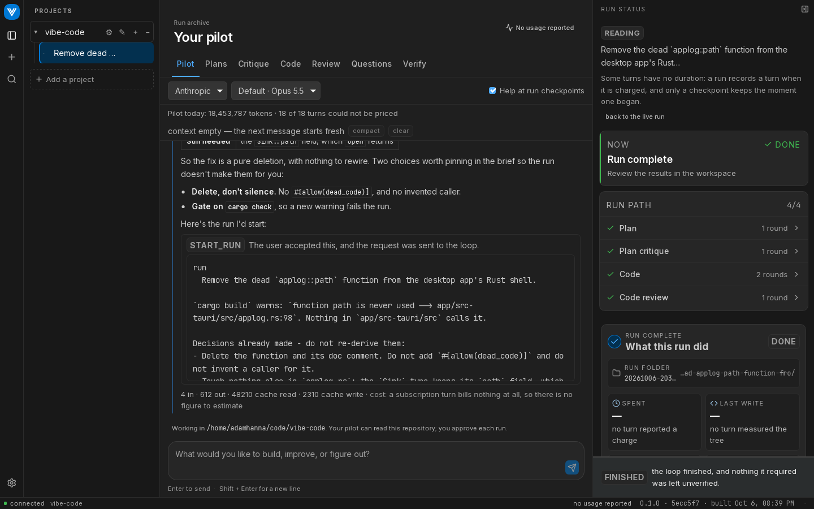
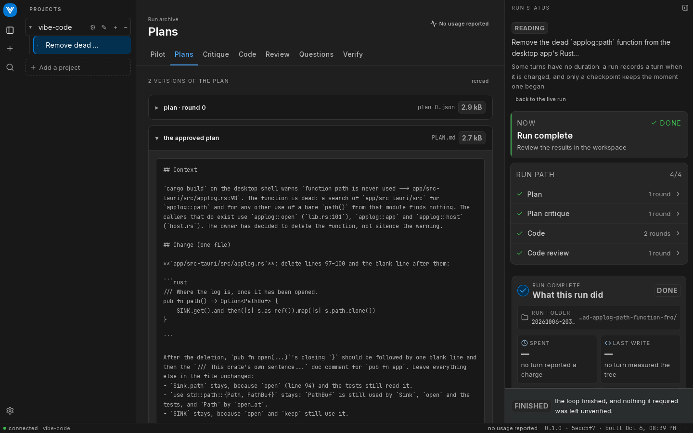
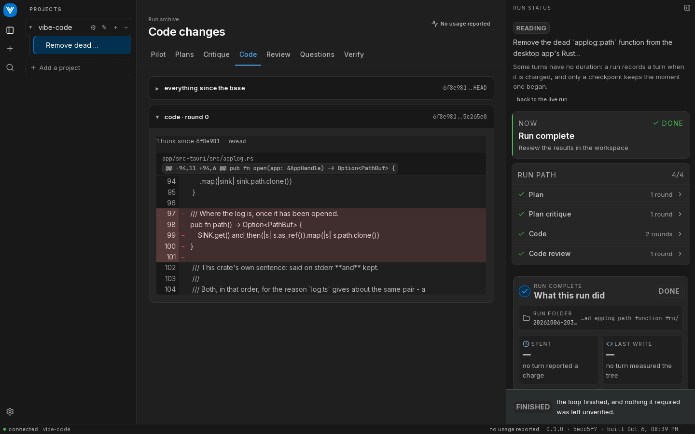

# The desktop app

The desktop app is the same loop with a window around it. It runs the same core as the CLI in its own process, so a run started in the app behaves exactly like `vibe run`. What it adds: a conversation that helps you write the brief, a live view of every round, gates that can hold and wait for you, and a stop button.



## Building it

Download the latest version:

| Platform | Download |
|---|---|
| Windows (x64) | [installer (`.exe`)](https://github.com/adam-hanna/vibe-code/releases/latest/download/Vibe-windows-x64-setup.exe) or [`.msi`](https://github.com/adam-hanna/vibe-code/releases/latest/download/Vibe-windows-x64.msi) |
| macOS (Apple Silicon only) | [`.dmg`](https://github.com/adam-hanna/vibe-code/releases/latest/download/Vibe-macos-arm64.dmg) |
| Linux (x86-64) | [`.AppImage`](https://github.com/adam-hanna/vibe-code/releases/latest/download/Vibe-linux-x86_64.AppImage) or [`.deb`](https://github.com/adam-hanna/vibe-code/releases/latest/download/Vibe-linux-amd64.deb) |

These links always point at the newest published release. Older versions, and pre-releases such as `v1.6.0-rc.1`, are on the [releases page](https://github.com/adam-hanna/vibe-code/releases). A pre-release is never what these links serve.

The builds are **unsigned**, so each operating system warns before the first launch:

- **macOS**: if it says the app is damaged or comes from an unidentified developer, move it to Applications and run `xattr -cr /Applications/Vibe.app`. There is no Intel build; Intel Macs build from source.
- **Windows**: SmartScreen says it protected your PC. Click **More info**, then **Run anyway**.

Or build it from source. You need Rust and the [Tauri prerequisites](https://tauri.app/start/prerequisites/) for your platform:

```bash
git clone https://github.com/adam-hanna/vibe-code.git
cd vibe-code && npm install && npm run build
cd app && npm install && npm run app:build
```

`npm run app:build` produces an installer and an executable under `app/src-tauri/target/release/`. The app needs the same `claude` and `codex` CLIs as the command line, installed and logged in.

## The window

The left sidebar lists your **projects** (each is a repository) and, under each, its **runs**. Clicking a run opens it. That is only a read: it never starts or resumes anything, and it costs nothing. A finished run is drawn exactly as it looked while it ran. Pin a run to keep it at the top, or rename it. Renaming changes only the label shown here, never the run's record.

The middle is the **pilot** and the run's tabs. The right-hand **run column** shows the loop: four groups (plan, plan critique, code, review), a card for each round with its severity counts, the turn running now with its elapsed time and token count, and a footer saying what the run is doing or how it ended. Click a round's counts to open its findings.

## The pilot

The pilot is a chat that can read your repository. Describe what you want built. It asks the questions that change the shape of the plan, looks for the gotchas, and then **proposes** a run: a card showing the exact command it would start. Nothing starts until you press it. The planner never sees this conversation, so the pilot's job is to write a brief that stands on its own.

The pilot can also make changes itself, run commands you approve, read the output of a dev server it started, and stop it. Commands on the safe list (`pilot.safeCommands`) run without a card. Everything else shows the exact program and arguments first. Starting a run and answering a gate always need your press. See the `pilot` settings in [Configuration](./configuration#sections-only-the-global-file-may-set).

For each vendor, the pilot and every run use either your **subscription** (the CLI's own login, billed nothing extra) or an **API key** stored in your operating system's keychain. Choose in Settings. On an API key, the pilot shows an estimated cost and can be given a daily ceiling; that spend is kept separate from the run's.

## The tabs



| Tab | What it shows |
|---|---|
| Plans | Every version of the plan, one section per round. |
| Plan critique | The critic's report for each plan round, with each finding's evidence. |
| Code review | The reviewer's report for each round, and what happened to each finding afterwards. |
| Code | What each round changed, from the commit it made, and the whole change so far. |
| Questions | The run's questions, which you answer in place. |
| Verify | Every verification attempt, with its verdict, and the full log of any that failed. |
| Output | Everything the run said, grouped by round, including what each model wrote. |
| Commands | Commands you or the pilot started, with their output. |



## Answering questions in place

When a run stops for you, the Questions tab shows each question with a box for your answer. Saving writes exactly the `NEEDS-INPUT.md` you would have written by hand. Resuming is a separate button, so saving never spends anything.

## Gates, pausing and stopping

The [`gates`](./configuration#gates) setting decides where a run holds. In the app, a `step` gate holds and waits for you to continue. The hold costs nothing, because the agent sessions stay warm while it waits. By default the app holds when the plan is approved, after the first implementation, after a failed verification, and after a review with findings.

**Pause** asks the run to hold at the next boundary, whatever the gates say, and can be cancelled before it gets there. It never interrupts a turn.

**Stop** kills the turn in flight and ends the run resumably. The confirmation tells you what that turn has spent, because that spend is charged anyway and the turn is redone from the start when you resume. Nothing before it is lost. A stop also works during a rate-limit wait and during the checks before the first turn.

## Several runs at once

The app can host several runs at the same time, each in its own process. `runs.maxConcurrent` in your settings for all projects caps how many; `0`, the default, is no limit. Two runs may not both work in the same checkout, because they would edit the same files. Give each run its own worktree with [`git.worktree`](./configuration#worktrees) to run them side by side in one repository.

When you quit while runs are going, the app lists them and asks first. Each one stops where it is and can be resumed.

## Settings

Settings has two doors. The ⚙ at the foot of the left bar edits your **settings for all projects**: models, budgets, round caps, `auth`, the pilot's permissions and the type size. The ⚙ on a project's row edits that project's **`vibe.config.json`**: its verification gates, worktree settings and anything it overrides. Each value shows where it comes from: the default, your settings for all projects, or this project. Model pickers list what each CLI says it offers today, and you can always type a name.

Settings also shows the standing prompt blocks every turn receives, and lets you override them per project. See [`prompts`](./configuration#prompts).

## Updates

The app checks for a newer version of itself once at launch and then every six hours. The check is one plain HTTPS request for a public file on GitHub (`latest.json` on the newest published release). It sends nothing that identifies you or your machine. To turn it off, open the ⚙ at the foot of the left bar, and under **Check for updates** untick the box. With it off, the app makes no request at all.

When a newer version exists, an arrow appears above the ⚙. Click it to see the version and the start of its release notes. **Skip this version** hides the arrow until a newer version comes out. Closing the popover just closes it.

**Update & restart** downloads the new version, checks its signature, installs it and restarts the app. If runs are going, it asks first. Restarting stops each run where it is, every run can be resumed, and only the turn each one was in is redone.

- **Windows:** the installer (`setup.exe`) updates without a prompt. An install from the `.msi` updates from the `.msi` and Windows shows a UAC prompt.
- **Linux `.deb`:** the app does not update itself. The popover shows **Download**, which opens the releases page, and you install the new `.deb` yourself. The AppImage updates itself in place.
- **macOS:** updates in place. This path has not yet been tested end to end.

Pre-releases are never offered, and neither is a version that is not newer than the one you are running. A failed check never shows on screen; it is written to the app's log, `vibe-desktop.log`.

## On Linux

Under some GPUs WebKitGTK paints a blank window. The app sets `WEBKIT_DISABLE_DMABUF_RENDERER=1` for itself on Linux unless you have set it, which avoids this.
